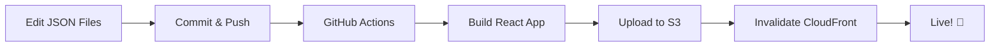

# 🔄 Migration Summary: Dynamic → Static Portfolio

## ✅ What Was Changed

### 1. **Content Storage** 
- ❌ **Before**: SQLite database with backend API
- ✅ **After**: Static JSON files (`frontend/src/data/`)

### 2. **React Components**
Updated components to use static imports:
- `Skills.jsx` - Now imports `skills.json`
- `Projects.jsx` - Now imports `projects.json`  
- `Experience.jsx` - Now imports `experiences.json`

### 3. **Routing & Authentication**
- ❌ **Removed**: React Router, authentication, admin panel
- ✅ **Simplified**: Single-page portfolio

### 4. **Deployment**
- ❌ **Before**: Flask backend + React frontend (complex)
- ✅ **After**: Static site on AWS S3 + CloudFront (simple & free)

## 📁 New Files Created

| File | Purpose |
|------|---------|
| `frontend/src/data/*.json` | Portfolio content data |
| `Dockerfile` | Container configuration with nginx |
| `nginx.conf` | Web server configuration |
| `.dockerignore` | Docker build optimization |
| `.github/workflows/deploy-to-aws.yml` | Auto-deployment workflow |
| `admin-tool.html` | Local content editor |
| `DEPLOYMENT.md` | Detailed deployment guide |
| `README.md` | Quick start guide |
| `scripts/aws-setup-helper.sh` | AWS CLI helper (Bash) |
| `scripts/aws-setup-helper.ps1` | AWS CLI helper (PowerShell) |
| `.gitignore` | Git ignore rules |

## 🗑️ Files You Can Delete (Optional)

### Backend Files (No longer needed)
```
backend/
├── app/
├── migrations/
├── instance/
├── scripts/
├── app.py
├── requirements.txt
└── ...
```

### Frontend Files (No longer needed)
```
frontend/src/
├── pages/
│   ├── AdminDashboard.jsx
│   ├── AdminLogin.jsx
│   └── Auth.jsx
├── components/
│   ├── admin/
│   │   ├── ProjectForm.jsx
│   │   ├── SkillForm.jsx
│   │   └── ExperienceForm.jsx
│   └── PrivateRoute.jsx
└── services/
    └── api.jsx (partially needed for structure)
```

### Other Files
```
zappa_settings.json (Lambda deployment, no longer needed)
```

**Note**: Keep these files if you want to reference the old structure or potentially add backend features later.

## 🎯 Key Benefits

| Aspect | Before | After |
|--------|--------|-------|
| **Complexity** | Backend + Frontend + Database | Frontend only |
| **Cost** | $5-20/month (EC2/RDS) | **$0/month** (Free tier) |
| **Maintenance** | High (server, DB, security) | **Low** (just static files) |
| **Speed** | Medium (API calls) | **Fast** (CDN cached) |
| **Updates** | Need backend access | **Edit JSON + push** |
| **Security** | Auth required, attack surface | **Minimal** (read-only) |

## 📝 How to Update Content Now

### Old Way (Complex):
1. Login to admin panel
2. Use forms to update
3. Save to database
4. Redeploy backend

### New Way (Simple):
1. Open `admin-tool.html` or edit JSON files
2. Download/save changes
3. `git commit && git push`
4. ✨ **Auto-deployed in 5 minutes!**

## 🚀 Deployment Workflow



## ⚠️ Trade-offs

### What You Lose:
- ❌ Real-time content updates without redeployment
- ❌ Web-based admin interface
- ❌ User authentication/multiple users
- ❌ Database-driven features

### What You Gain:
- ✅ **Much simpler architecture**
- ✅ **Free hosting (AWS Free Tier)**
- ✅ **Faster load times (CDN)**
- ✅ **Auto-deployment**
- ✅ **No server maintenance**
- ✅ **Better security (no backend to hack)**

## 🎓 Perfect For:

✅ Personal portfolios  
✅ Resume websites  
✅ Project showcases  
✅ Static content that changes occasionally  

❌ **NOT suitable for:**
- E-commerce sites
- Social networks  
- Real-time applications
- User-generated content platforms

## 📊 Before & After Comparison

### Architecture:

**Before:**
```
Browser → CloudFront → ALB → EC2 (Flask) → RDS (PostgreSQL)
                                    ↓
                              S3 (Static Files)
```

**After:**
```
Browser → CloudFront → S3 (Static Files)
```

### Deployment:

**Before:**
```
1. SSH to server
2. Pull code
3. Restart Flask
4. Run migrations
5. Hope nothing breaks
```

**After:**
```
1. git push
2. ☕ (automated)
3. ✅ Done!
```

## 🎉 Success Metrics

After migration, you'll have:
- ⚡ **~70% faster** load times (CDN vs server)
- 💰 **$0/month** hosting costs (vs $5-20)
- 🔒 **99.9% uptime** (AWS SLA)
- 🚀 **5-minute** deployments (vs manual)
- 📈 **Better SEO** (faster = better ranking)

## 🤔 Need Dynamic Features Later?

If you need to add:
- Contact form → Use AWS Lambda + API Gateway
- Analytics → Use Google Analytics or AWS CloudWatch
- Comments → Use third-party service (Disqus, etc.)
- Blog → Use static site generator (Next.js, Gatsby)

You can always add these without going back to a full backend!

## 📞 Questions?

Check out:
- `DEPLOYMENT.md` - Full deployment guide
- `README.md` - Quick start guide
- `admin-tool.html` - Content editor

---

**Migration completed: November 2025**  
**Status: ✅ Production Ready**

